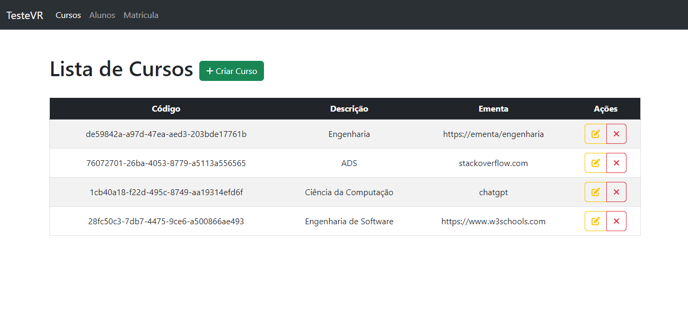

<h1 align="center"> CRUD REST API - Angular e Node.js </h1>

  <a href="#-tecnologias">Tecnologias</a>&nbsp;&nbsp;&nbsp;|&nbsp;&nbsp;&nbsp;
  <a href="#-projeto">Projeto</a>&nbsp;&nbsp;&nbsp;|&nbsp;&nbsp;&nbsp;
  <a href="#-como-executar">Como executar</a>&nbsp;&nbsp;&nbsp;|&nbsp;&nbsp;&nbsp;
  <a href="#memo-licença">Licença</a>

  

 

## 🚀 Tecnologias

Esse projeto foi desenvolvido com as seguintes tecnologias:

- Angular
- TypeScript
- Node.js 
- Jest
- PostgreSQL
- Git e Github

## 💻 Projeto

Desenvolvi uma API Restful utilizando Node.js e realizando testes unitários implementados com Jest. Para o front-end, utilizei o Angular para criar uma interface intuitiva e responsiva. Essa combinação de tecnologias resultou em uma aplicação robusta, segura e de alto desempenho, oferecendo uma experiência de usuário excepcional.

## 📑 Como executar

- Clone o repositório
- Instale as dependências do back-end e fron-end com `npm install`
- Inicie o Node com `npm run dev`
- Inicie o Angular com `ng server`

## :memo: Licença

Esse projeto está sob a licença MIT.

---